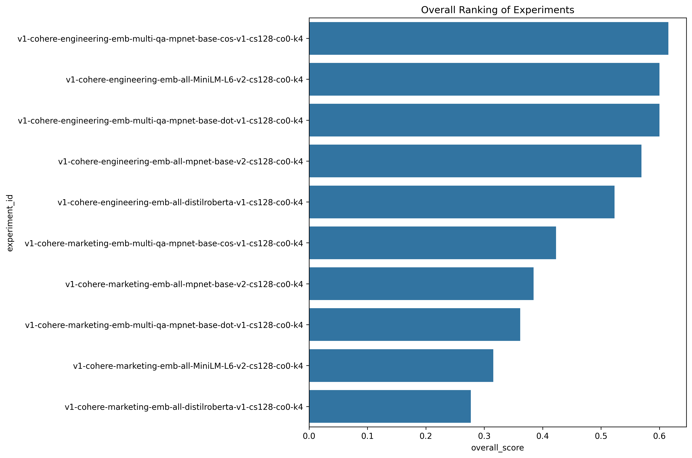
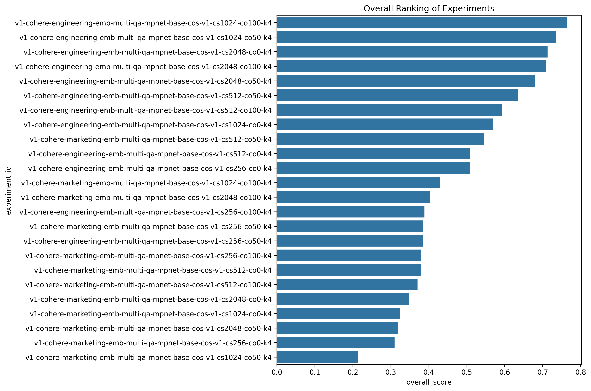
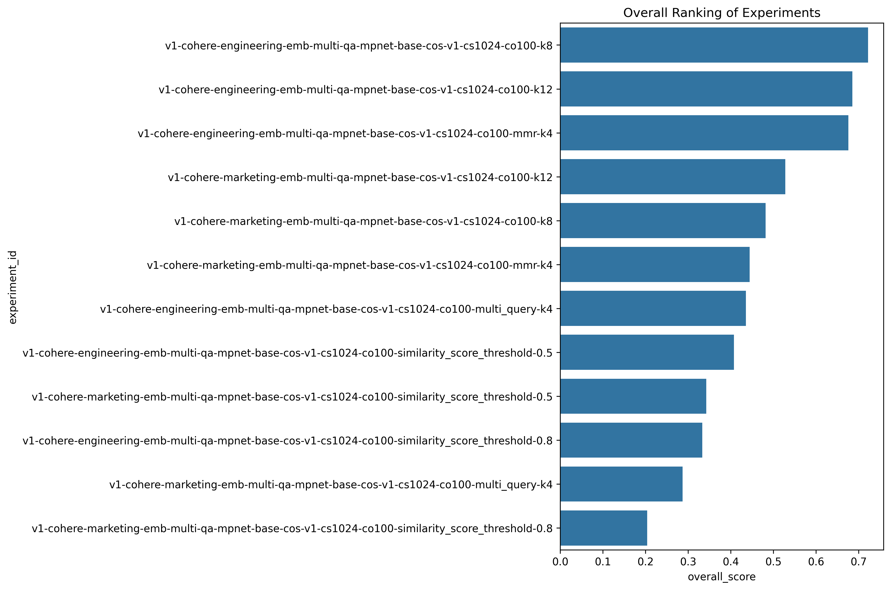
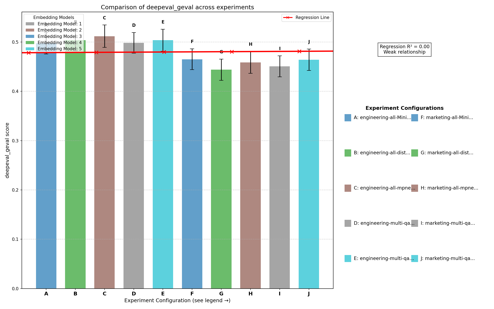
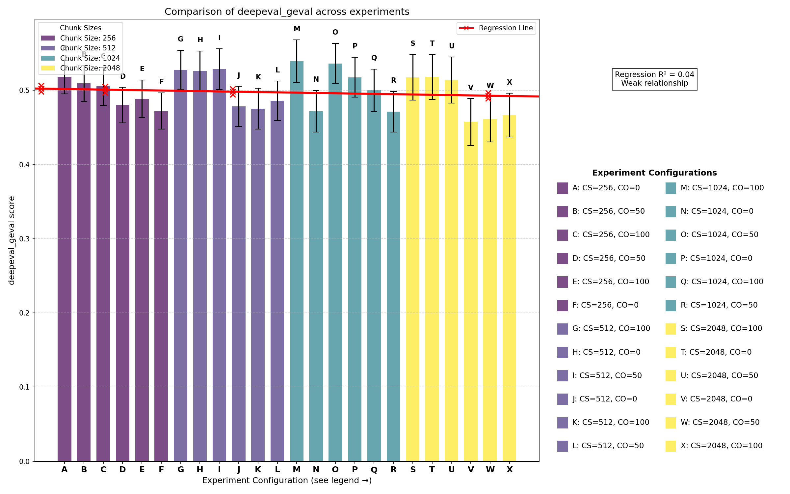
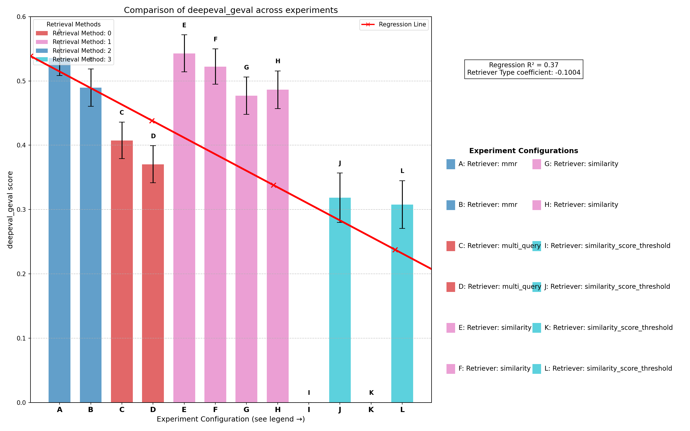
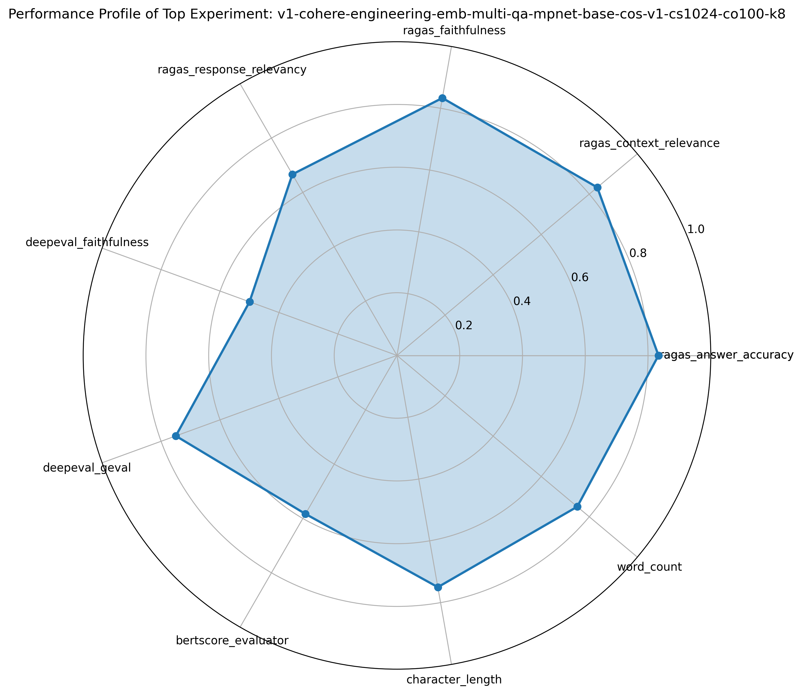

\newpage
\appendix
\section*{Appendix}

## Extended Methodology

### Detailed Technical Approach
The implementation followed a phased approach to systematically explore different aspects of the RAG pipeline. The research methodology was designed to isolate and evaluate key performance factors while maintaining experimental control.

In the first phase focused on embedding model selection, I tested five embedding models (all-mpnet-base-v2, all-MiniLM-L6-v2, all-distilroberta-v1, multi-qa-mpnet-base-cos-v1, and multi-qa-mpnet-base-dot-v1) while keeping other parameters constant. This established the foundation for subsequent experiments by identifying the most effective semantic representation for the corpus. The embedding-first approach was deliberate as it determines how documents are represented in vector space, fundamentally constraining all downstream retrieval performance. Since switching embedding models requires re-embedding the entire corpus—making it computationally expensive—identifying the best model early allowed me to focus subsequent phases on parameter optimization. Though in reality, this principled stance was somewhat academic given the relatively small size of the RAG corpus used in the experiments.

The second phase concentrated on chunking parameter optimization. Using the best-performing embedding model identified in Phase 1, I explored variations in chunk size (256, 512, 1024, 2048 tokens) and chunk overlap (0, 50, 100 tokens) to determine the optimal document segmentation strategy. These parameters directly influence what information is captured in each vector, affecting both retrieval precision and the context provided to the LLM. Document chunking represents a critical balance between granularity and coherence—too small chunks may lose important contextual connections, while too large chunks might dilute relevance signals with unrelated information.

With optimized embeddings and chunking parameters established, the third phase involved retrieval strategy refinement. I experimented with advanced retrieval techniques including similarity-based retrieval with various top-k values (4, 8, 12), Maximum Marginal Relevance (MMR) for diversity enhancement, and similarity score thresholding at different levels (0.5, 0.8). These strategies operate on the already-embedded documents and don't require reprocessing the corpus, making them computationally efficient to test at scale across the evaluation set.

For catering to the two different teams, I implemented distinct query templates. The engineering template emphasized technical language with precise terminology, focusing on accuracy and comprehensiveness appropriate for technical audiences. In contrast, the marketing template employed conversational language with simplified terminology, prioritizing clarity and accessibility for non-technical users. The template selection adjusts how the system frames questions to the retrieval component, leading to different context selection and ultimately tailored responses for different audience needs. This allowed for testing whether RAG systems could effectively adapt to different communication contexts while maintaining factual accuracy. I experimented with 4 and 3 templates for engineering and marketing, respectively, evaluating the RAG output by hand, until I was satisifed with the output. The final templates were used for all experiments.

For the RAG generator component, I evaluated both Cohere and Mistral models. After conducting multiple comprehensive evaluations, I decided to exclusively use Cohere for the remainder of the experiments for two critical reasons: First, Mistral's output quality was substantively worse than Cohere's in my comparative tests. Second, and perhaps more importantly, Mistral's performance was significantly slower despite Cohere requiring network calls. RAG pipelines using Mistral took upwards of 25 seconds to fulfill requests, whereas Cohere consistently delivered responses within 2-3 seconds. This performance gap existed even with Mistral running with 4-bit quantization, which likely further degraded output quality compared to Cohere's hosted solution.

All development was conducted on an Amazon EC2 instance of type g4dn.xlarge, which contains one NVIDIA T4 GPU, 4 vCPUs, and 16 GB of memory. While a more powerful GPU such as an A100 would likely have allowed Mistral to run more efficiently, this option was cost-prohibitive for the research budget.

### Detailed Evaluation Process
I used LangSmith to log and analyze all evaluation results throughout the experimental process. The evaluation workflow followed a structured approach to ensure comprehensive and reproducible results.

The process began with running the `run_phased_evaluations.py` script, which orchestrated the evaluation of all 78 questions in the validation set against the specified evaluation metrics. This script logged all runs and traces to LangSmith, providing a detailed record of each evaluation step. Each question generated a trace that broke down each sub-step of the pipeline, including retrieval time from the vector store, which documents were retrieved, and the final templated input before processing through the RAG system's LLM. This detailed tracing enabled thorough analysis of where different configurations succeeded or failed.

In addition to LangSmith logging, the script recorded all runs to local JSON files for offline analysis. This redundancy ensured data preservation and allowed for custom analysis approaches beyond what LangSmith natively offers. After completing the evaluations, I analyzed the results using a custom script, `analyze_top_performers.py`, which identified the top-performing RAG system configurations based on an un-weighted, normalized aggregate of all relevant evaluation metrics. This script produced rankings of configurations and highlighted performance patterns across different parameter combinations. For future work, I would implement a weighting mechanism to give preference to evaluation metrics deemed more important by researchers for specific use cases.

The final step involved running statistical analysis using the `analyze_statistical_significance.py` script. This ensured that the findings were statistically significant and helped quantify effect sizes for different parameter changes. Additionally, I conducted regression analyses to identify correlations between independent variables and evaluation metrics, which revealed important relationships between configuration choices and performance outcomes.

### Comprehensive Testing and Evaluation
I evaluated system performance using 13 distinct metrics across three categories:

- Simple Metrics (Binary LLM-as-judge):
  - Groundedness: Is the RAG response factually consistent with the provided context?
  - Retrieval Relevance: Are the retrieved documents pertinent to the question?
  - Relevance: Is the answer relevant to the question?
  - Correctness: Is the answer in agreement with the reference ground truth?

These metrics were implemented manually, by me, following a [tutorial from LangChain's documentation](https://docs.smith.langchain.com/evaluation/tutorials/rag#correctness-response-vs-reference-answer).

- RAGAS Metrics (Normalized LLM-as-judge):
  - [Faithfulness](https://docs.ragas.io/en/latest/concepts/metrics/available_metrics/faithfulness/): Equivalent to Groundedness (above).
  - [Context Relevance](https://docs.ragas.io/en/latest/concepts/metrics/available_metrics/nvidia_metrics/#context-relevance): Equivalent to Retrieved Relevance (above).
  - [Response Relevance](https://docs.ragas.io/en/latest/concepts/metrics/available_metrics/answer_relevance/): Equivalent to Relevance (above).
  - [Answer Accuracy](https://docs.ragas.io/en/latest/concepts/metrics/available_metrics/nvidia_metrics/): Equivalent to Correctness (above).

- Additional Metrics:
  - [DeepEval G-Eval](https://www.deepeval.com/docs/metrics-llm-evals): Framework using LLM-as-judge with chain-of-thought. The authors of DeepEval claim that G-Eval most versatile metric they have to offer, claiming that it is capable of evaluating almost any use case with human-like accuracy.
  - [DeepEval Faithfulness](https://www.deepeval.com/docs/metrics-faithfulness): Measures hallucination in RAG systems. Although similar to the Hallucination metric, the DeepEval Faithfulness metric is more concerned with contradictions between the actual output and retrieval context in RAG pipelines, rather than hallucination in the actual LLM itself.
  - [BERTScore](https://github.com/Tiiiger/bert_score): Semantic similarity between response and reference
  - Word count and character count: Heuristic length metrics comparing the actual output to the reference output

Testing was conducted on a set of 78 domain-specific questions with reference answers. Each experimental configuration processed all questions, with results analyzed for statistical significance using ANOVA tests (producing F-values and p-values), pairwise t-tests between configurations, and regression analyses to determine correlations between parameters and performance metrics. For all LLM-as-judge evaluations (10 of the 13 metrics), I used GPT-4o as the judge model.

11 of the 13 metrics (all LLM-as-judge evaluations plus BERTScore) were recorded in LangSmith. The remaining two metrics—character count and word count—were simpler heuristics logged offline. I was inspired to track these length metrics because my initial generator templates produced good content that was substantially more verbose than the reference answers. I tracked the ratio between generated and reference lengths, working under the assumption that a high BERTScore similarity combined with a word/character count ratio close to 1.0 would indicate output very close to the reference answer.

My metric selection evolved throughout the research process. I initially developed the four Simple Metrics from scratch following the intuition that I should measure relationships between the four pertinent components of any RAG system: the input question, retrieved contexts, output answer, and reference answer. These essential relationships form the foundation of RAG evaluation.

Unsatisfied with these initial results, further research led me to discover the equivalent RAGAS metrics, which appeared more robust in their implementation. I implemented these alongside my simple metrics to compare performance, specifically to determine if the simpler (and less computationally expensive) metrics could approximate the more sophisticated RAGAS evaluations at lower cost. The Simple Metrics and RAGAS Metrics measure similar concepts but differ in methodology. The Simple Metrics use a single inference request per question-answer pair to produce binary scores, while RAGAS metrics typically involve at least two inference calls. For example, while Simple Correctness produces a binary score about agreement with the reference answer, RAGAS Answer Accuracy performs two independent judge passes with scores from 0 to 2, then normalizes them to produce increments of 0.25. This results in more stable means across the full evaluation set.

Still seeking more reliable evaluation signals, I explored additional evaluation frameworks and discovered DeepEval. Their G-Eval metric particularly impressed me during preliminary testing, demonstrating promising results that aligned well with my human judgment. As the research progressed, I came to rely on G-Eval as a key measure of success, giving it more weight in my human analysis compared to other metrics, though I maintained the full suite to ensure comprehensive evaluation across multiple dimensions.

## Extended Results and Findings

### Additional Statistical Insights
The following visualizations present additional statistical insights not covered in the main report:

## Extended Challenges and Limitations

Several significant limitations emerged during the experimental process:

Metric inconsistency presented a notable challenge, as different evaluation frameworks sometimes yielded contradictory results. This inconsistency complicated the determination of an optimal configuration. For instance, DeepEval's faithfulness metric consistently rated systems favorably (95th percentile), while RAGAS faithfulness assessments were markedly more stringent. This discrepancy highlights the importance of employing multiple evaluation frameworks when assessing RAG systems.

The utilization of large language models as evaluation judges introduced potential methodological concerns regarding subjectivity. These models may exhibit inherent biases toward specific response patterns or writing styles, potentially compromising the objectivity of evaluation scores. Future research should investigate methods to mitigate these biases through calibration techniques or alternative evaluation approaches.

Many observed performance differences did not achieve statistical significance. This suggests that either a larger test corpus or more pronounced parameter adjustments would be necessary to draw definitive conclusions. It also suggests the need for robust experimental design.

Attribution of performance improvements presented another methodological challenge. It was often difficult to determine whether factual accuracy resulted from successful retrieval or from the language model's pre-existing knowledge. This ambiguity complicates the isolation of retrieval quality as an independent variable and highlights the need for more sophisticated attribution mechanisms in RAG evaluation.

Resource constraints necessitated a phased experimental approach rather than a comprehensive factorial design. While this methodology was practical, it potentially overlooked optimal parameter combinations that might exist across phase boundaries. A full factorial design would have required thousands of experimental runs, which was not feasible given my budget.

Financial considerations significantly impacted the research scope. The evaluation methodology often required multiple LLM judge calls per question-answer pair, resulting in substantial API expenses exceeding $300 for GPT-4o alone. Additional costs included LangSmith storage fees, virtual machine rental, and Cohere API charges. This financial burden represents a significant barrier to entry for comprehensive RAG research, particularly for researchers without access to institutional resources.

Hardware limitations further constrained model selection options. The NVIDIA T4 GPU available on the g4dn.xlarge instance (AWS EC2) proved inadequate for efficient Mistral model inference. A typical RAG pipeline utilizing self-hosted Mistral required approximately 24 seconds for completion, compared to 2-3 seconds for Cohere's API service—despite the inherent network latency disadvantage of the latter. This performance disparity can be attributed to insufficient computational capacity for efficient model inference.

With additional time and resources, several promising directions could be explored:

- Hybrid Retrieval Strategies: Combining MMR for diversity with similarity-based filtering could potentially yield better results than either approach alone.
- Parameter Fine-Tuning: More granular exploration of chunk sizes, and an expanded evaluation range (e.g., 128-6144) and overlap percentages could identify more precise optimal values, as well as performance inflection points.
- Prompt Engineering Optimization: Systematic evaluation of different prompt structures for both retrieval and generation could further enhance performance.
- Cross-Domain Testing: Evaluating the best configurations on different document types and domains would test the generalizability of findings.
- LLM Comparison: Comparing performance across different foundation models (e.g., Mistral, Claude, GPT-4) would help isolate the effects of the retrieval component versus the LLM capabilities. This could be done by expanding the range of acceptable generator models, and by exploring the relationship between generator LLMs and evaluator LLMs to the presence of bias penalties implicit to the evaluator LLM.

## Statistical Analyses

